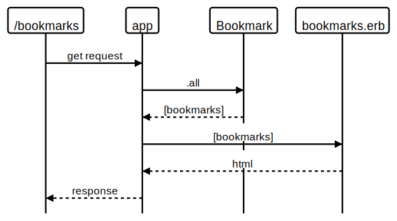

# bookmark_manager

## User Stories

```
As a user
So that I can see the bookmarks I have
I would like to get a list of bookmarks
```

# bookmark_manager


1. Connect to psql
2. Create the database using the psql command CREATE DATABASE bookmark_manager;
3. Connect to the database using the pqsl command \c bookmark_manager;
4. Run the query we have saved in the file 01_create_bookmarks_table.sql
